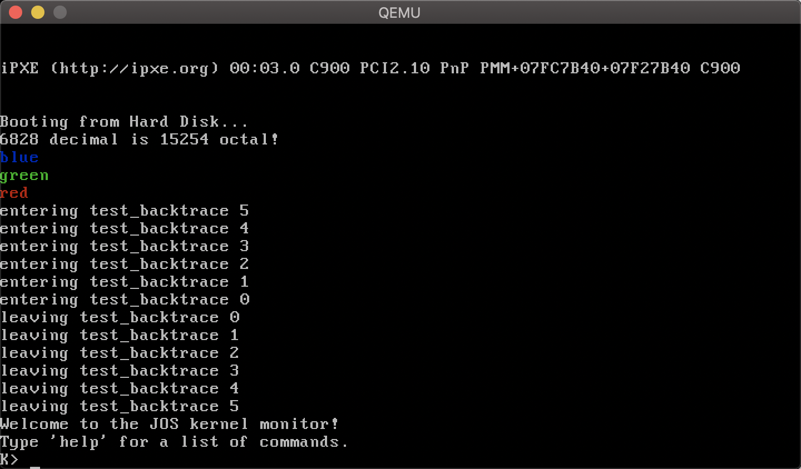

# Learning Jos From Scratch: Lab1

## Overview

This lab is mainly about **PC Bootstrap** and **GC Calling Conventions**. 

## Getting Started

### Mac OS

#### Build Your Own Complier Toolchain

First, install `brew`

```
/usr/bin/ruby -e "$(curl -fsSL https://raw.githubusercontent.com/Homebrew/install/master/install)”
```

Then, install the toolchains

```
brew install i386-elf-gcc i386-elf-gdb
```

#### QEMU Simulator

First, specify that we want use tap from [HMC CS134](https://www.cs.hmc.edu/~rhodes/courses/cs134/sp19/)

```shell
brew tap nrhodes/homebrew-os134sp19
```

Then, install qemu with

```
brew install nrhodes/homebrew-os134sp19/qemu
```

Sometimes, you may need to enter following command to use `i386-elf-gdb`

```
brew link --overwrite i386-elf-gdb
```

And you can enter following command to use you own gdb

```
brew link --overwrite gdb
```

## Exercise

### Exercise 1

#### Question

*Familiarize yourself with the assembly language materials available on [the CS 134 reference page](https://www.cs.hmc.edu/~rhodes/courses/cs134/sp19/reference.html). You don't have to read them now, but you'll almost certainly want to refer to some of this material when reading and writing x86 assembly.*

*We do recommend reading the section "The Syntax" in [Brennan's Guide to Inline Assembly](http://www.delorie.com/djgpp/doc/brennan/brennan_att_inline_djgpp.html). It gives a good (and quite brief) description of the AT&T assembly syntax we'll be using with the GNU assembler in JOS.*

#### Answer

Read book to learn how to read x86 assembly. 

### Exercise 2

#### Question

*Use GDB's si (Step Instruction) command to trace into the ROM BIOS for a few more instructions, and try to guess what it might be doing. You might want to look at [Phil Storrs I/O Ports Description](http://web.archive.org/web/20040404164813/members.iweb.net.au/~pstorr/pcbook/book2/book2.htm), as well as other materials on the [CS 134 reference materials page](https://www.cs.hmc.edu/~rhodes/courses/cs134/sp19/reference.html). No need to figure out all the details - just the general idea of what the BIOS is doing first.*

#### Answer

Learn GDB and keep *step in* !

### Exercise 3

#### Question

*Take a look at the [lab tools guide](https://www.cs.hmc.edu/~rhodes/courses/cs134/sp19/labguide.html), especially the section on GDB commands. Even if you're familiar with GDB, this includes some esoteric GDB commands that are useful for OS work.*

*Set a breakpoint at address 0x7c00, which is where the boot sector will be loaded. Continue execution until that breakpoint. Trace through the code in `boot/boot.S`, using the source code and the disassembly file `obj/boot/boot.asm` to keep track of where you are. Also use the `x/i` command in GDB to disassemble sequences of instructions in the boot loader, and compare the original boot loader source code with both the disassembly in `obj/boot/boot.asm` and GDB.*

*Trace into `bootmain()` in `boot/main.c`, and then into `readsect()`. Identify the exact assembly instructions that correspond to each of the statements in `readsect()`. Trace through the rest of `readsect()` and back out into `bootmain()`, and identify the begin and end of the `for` loop that reads the remaining sectors of the kernel from the disk. Find out what code will run when the loop is finished, set a breakpoint there, and continue to that breakpoint. Then step through the remainder of the boot loader.*

#### Answer

Keep using gdb `si` command and `x/I` command can disassemble sequences of instructions. We can find following things:

- The point that the processor starts executing 32-bit code and that the professor switches from 16 to 32-bit mode. 

- The *last* instruction of the boot loader executed and the *first* instruction of the kernel. 

- The boot loader uses following code to fetch the entire kernel from disk. 

  ```c
  // load each program segment (ignores ph flags)
  ph = (struct Proghdr *) ((uint8_t *) ELFHDR + ELFHDR->e_phoff);
  eph = ph + ELFHDR->e_phnum;
  for (; ph < eph; ph++)
    // p_pa is the load address of this segment (as well
    // as the physical address)
    readseg(ph->p_pa, ph->p_memsz, ph->p_offset)
  ```

### Exercise 4

#### Question

*Read about programming with pointers in C. The best reference for the C language is The C Programming Language by Brian Kernighan and Dennis Ritchie (known as 'K&R'). We recommend that students purchase this book (here is an [Amazon Link](http://www.amazon.com/C-Programming-Language-2nd/dp/0131103628/sr=8-1/qid=1157812738/ref=pd_bbs_1/104-1502762-1803102?ie=UTF8&s=books)) or find one of [MIT's 7 copies](http://library.mit.edu/F/AI9Y4SJ2L5ELEE2TAQUAAR44XV5RTTQHE47P9MKP5GQDLR9A8X-10422?func=item-global&doc_library=MIT01&doc_number=000355242&year=&volume=&sub_library=).*

*Read 5.1 (Pointers and Addresses) through 5.5 (Character Pointers and Functions) in K&R. Then download the code for [pointers.c](https://www.cs.hmc.edu/~rhodes/courses/cs134/sp19/labs/lab1/pointers.c), run it, and make sure you understand where all of the printed values come from. In particular, make sure you understand where the pointer addresses in printed lines 1 and 6 come from, how all the values in printed lines 2 through 4 get there, and why the values printed in line 5 are seemingly corrupted.*

*There are other references on pointers in C (e.g., [A tutorial by Ted Jensen](https://www.cs.hmc.edu/~rhodes/courses/cs134/sp19/readings/pointers.pdf) that cites K&R heavily), though not as strongly recommended.*

#### Answer

*Pointer is the spirit of C.*

### Exercise 5

#### Question

*Trace through the first few instructions of the boot loader again and identify the first instruction that would "break" or otherwise do the wrong thing if you were to get the boot loader's link address wrong. Then change the link address in `boot/Makefrag` to something wrong, run make clean, recompile the lab with make, and trace into the boot loader again to see what happens. Don't forget to change the link address back and make clean again afterward!*

#### Answer

Change the boot loader’s link address will cause error because BIOS will transfer control to invalid address. 

### Exercise 6

#### Question

*We can examine memory using GDB's x command. The [GDB manual](https://sourceware.org/gdb/current/onlinedocs/gdb/Memory.html) has full details, but for now, it is enough to know that the command x/Nx ADDR prints N words of memory at ADDR. (Note that both '`x`'s in the command are lowercase.) Warning: The size of a word is not a universal standard. In GNU assembly, a word is two bytes (the 'w' in xorw, which stands for word, means 2 bytes).*

*Reset the machine (exit QEMU/GDB and start them again). Examine the 8 words of memory at 0x00100000 at the point the BIOS enters the boot loader, and then again at the point the boot loader enters the kernel. Why are they different? What is there at the second breakpoint? (You do not really need to use QEMU to answer this question. Just think.)*

#### Answer

At the first break point, it will all be 0’s. It’s because that the kernel hasn’t been loader.  And at the second break point, it will contain information about kernel. 

### Exercise 7

#### Question

*Use QEMU and GDB to trace into the JOS kernel and stop at the `movl %eax, %cr0`. Examine memory at 0x00100000 and at 0xf0100000. Now, single step over that instruction using the stepi GDB command. Again, examine memory at 0x00100000 and at 0xf0100000. Make sure you understand what just happened.*

*What is the first instruction after the new mapping is established that would fail to work properly if the mapping weren't in place? Comment out the `movl %eax, %cr0` in `kern/entry.S`, trace into it, and see if you were right.*

#### Answer

In `gdb`, use following command to examine before `movl %eax, %cr0`

```
b *0x00100020
x/8w 0x00100000
x/8w 0xf0100000
```

*Before*, examine memory at 0x00100000 (the kernel data)

```
0x100000:       0x1badb002      0x00000000      0xe4524ffe      0x7205c766
0x100010:       0x34000004      0x0000b812      0x220f0011      0xc0200fd8
```

Examine memory at 0xf0100000 (unmapped now)

```
0xf010000:      0x00000000      0x00000000      0x00000000      0x00000000
0xf010010:      0x00000000      0x00000000      0x00000000      0x00000000
```

*After*, examine memory at 0x00100000 (the kernel data)

```
0x100000:       0x1badb002      0x00000000      0xe4524ffe      0x7205c766
0x100010:       0x34000004      0x0000b812      0x220f0011      0xc0200fd8
```

Examine memory at 0xf0100000 (already mapped now)

```
0xf0100000: 		0x1badb002      0x00000000      0xe4524ffe      0x7205c766
0xf0100010:   	0x34000004      0x0000b812      0x220f0011      0xc0200fd8
```

So we can find that  virtual address [0xf0000000, 0xf0400000] mapped to physical addresses [0x00000000,  0x00400000]. 

Similarly virtual address [0x00000000, 0x00400000] also are mapped to the same physical address range. 

If we comment our the `movl %eax, %cr0`, the next instructions will jump to address `0xf010002c`

```assembly
mov	$relocated, %eax
jmp	*%eax
```

But the address `0xf010002c` is still unmapped, so it still is 0’s. So it will cause an error!

### Exercise 8

#### Question

*We have omitted a small fragment of code - the code necessary to print octal numbers using patterns of the form "%o". Find and fill in this code fragment.*

*And answer following questions*

- *Explain the interface between `printf.c` and `console.c`. Specifically, what function does `console.c` export? How is this function used by `printf.c`?*

- *Explain the following from `console.c*`

  ```c++
  if (crt_pos >= CRT_SIZE) {
    int i;
    memmove(crt_buf, crt_buf + CRT_COLS, (CRT_SIZE - CRT_COLS) * sizeof(uint16_t));
    for (i = CRT_SIZE - CRT_COLS; i < CRT_SIZE; i++)
    crt_buf[i] = 0x0700 | ' ';
    crt_pos -= CRT_COLS;
  }
  ```

- *For the following questions you might wish to consult the notes for Lecture 2. These notes cover GCC's calling convention on the x86.*

  *Trace the execution of the following code step-by-step:*

  ```c++
  int x = 1, y = 3, z = 4;
  cprintf("x %d, y %x, z %d\n", x, y, z);
  ```

  - *In the call to `cprintf()`, to what does `fmt` point? To what does `ap` point?*
  - *List (in order of execution) each call to `cons_putc`, `va_arg`, and `vcprintf`. For `cons_putc`, list its argument as well. For `va_arg`, list what `ap` points to before and after the call. For `vcprintf` list the values of its two arguments.*

- *Run the following code.*

  ```c
  unsigned int i = 0x00646c72;
  cprintf("H%x Wo%s", 57616, &i);
  ```

  *What is the output? Explain how this output is arrived at in the step-by-step manner of the previous exercise. [Here's an ASCII table](https://web.archive.org/web/20160304171108/http://web.cs.mun.ca/~michael/c/ascii-table.html)*

  *The output depends on that fact that the x86 is little-endian. If the x86 were instead big-endian what would you set `i` to in order to yield the same output? Would you need to change `57616` to a different value?*

- *In the following code, what is going to be printed after `'y='*`

  ```c
  cprintf("x=%d y=%d", 3);
  ```

#### Answer

Fill the code fragment

```c
// (unsigned) octal
case 'o':
  num = getuint(&ap, lflag);
  base = 8;
  goto number;
```

- `console.c` use function `cprinf()` provided by `printf.c`. 

- If the console is full of characters, remove the first row and move to a new row. 

  - `fmt` points to `"x %d, y %x, z %d\n”` and `ap` points to `0xf010ffd4`

  - `vcprintf()` the arguments

    ```c++
    vcprintf (fmt=0xf01017b2 "x %d, y %x, z %d\n", ap=0xf010ffd4 "\001")
    ```

    `consputc()` argument: 120 (when print the first `x`)

    `va_arg`, after the first call `ap` points to ` 0xf010ffd8 `. 

- The output will be `He110 World`. 
  57616 => e110 in hex
  Little endian `i = 0x00646c72`, will be bytes sequence in memory `72 6c 64 00`. 
  `72` in hex will be r, `6c` in hex will be l, `6d` in hex will be d. `00` will be `\0` . 
  If big endian, we need to change `i = 0x726c6400`. No need to change 5676

- In my experiment, it is `y=1600`, because what `ap` points now is unknown. 

- Create new file `inc/textcolor.h` and add a new global variable `textcolor`
  Modify `printfmt.c` 

  ```c++
  while ((ch = *(unsigned char *) fmt++) != '%') {
    textcolor = 0x0700;
    if (ch == '\0')
    return;
    putch(ch, putdat);
    // Process a %-escape sequence
    padc = ' ';
    width = -1;
    precision = -1;
    lflag = 0;
    altflag = 0;
  	reswitch:
  		switch (ch = *(unsigned char *) fmt++) {
  
  		// 'm' means to set color
  		case 'm':
  			textcolor = getint(&ap, lflag);
  			break;
      ....
      }
  ```

  Modify console.c

  ```c++
  static void
  cga_putc(int c)
  {
  	// if no attribute given, then use black on white
  	if (!(c & ~0xFF)) {
  		c |= textcolor;
  	}
    ...
  }
  ```

  Finally, add code in function `i386_init()` in `init.c`. 

  ```c
  cprintf("%m%s\n", 0x0100, "blue");
  cprintf("%m%s\n", 0x0200, "green");
  cprintf("%m%s\n", 0x0400, "red");
  ```

   

  

### Exercise 9

#### Question

*Determine where the kernel initializes its stack, and exactly where in memory its stack is located. How does the kernel reserve space for its stack? And at which "end" of this reserved area is the stack pointer initialized to point to?*

#### Answer

The kernel initializes its stack pointer at address `0xf0110000` 

```shell
# Set the stack pointer
movl	$(bootstacktop),%esp
```

The end of this reserved area is `0xf0108000`， because `kSTKNSIZE = 32KB . ` 

### Exercise 10

#### Question

*To become familiar with the C calling conventions on the x86, find the address of the `test_backtrace` function in `obj/kern/kernel.asm`, set a breakpoint there, and examine what happens each time it gets called after the kernel starts. How many 32-bit words does each recursive nesting level of `test_backtrace` push on the stack, and what are those words?*

#### Answer

```asm
push   %ebp
mov    %esp,%ebp
push   %ebx
sub    $0xc,%esp
```

### Exercise 11

#### Question

*Implement the backtrace function as specified above. Use the same format as in the example, since otherwise the grading script will be confused. When you think you have it working right, run make grade to see if its output conforms to what our grading script expects, and fix it if it doesn't. After you have handed in your Lab 1 code, you are welcome to change the output format of the backtrace function any way you like.*

#### Answer

We need to implement function in `kern/monitor.c` 

```c++
int mon_backtrace(int argc, char **argv, struct Trapframe *tf)
{
	int ebp;
	int eip;
	cprintf("Stack backtrace:\n");
	// First get the base pointer address
	asm(
		"movl %%ebp, %0"
		:"=r"(ebp)
		:
		:
	);
	while (ebp != 0) {
		// Get eip address
		asm(
			"movl 4(%1), %0"
			:"=r"(eip)
			:"r"(ebp)
			:
		);
		int arg[5];
		int curAddr = ebp + 4;
		// Get Args value
		for (int i = 0; i < 5; i++) {
			asm(
				"movl 4(%1), %0"
				:"=r"(arg[i])
				:"r"(curAddr)
				:
			);
			curAddr += 4;
		}
		// Get debug info
		struct Eipdebuginfo info;
		debuginfo_eip(eip, &info);
		// Display debug info
		cprintf("  ebp %08x eip %08x args %08x %08x %08x %08x %08x\n", ebp, eip, arg[0], arg[1], arg[2], arg[3], arg[4]);
		// Display file and function info	
		cprintf("    %s:%d: %.*s+%d\n", info.eip_file, info.eip_line, info.eip_fn_namelen, info.eip_fn_name, eip - info.eip_fn_addr);
		// Update base pointer
		asm(
			"movl (%1), %%eax;"
			"movl %%eax, %0;"
			:"=r"(ebp)
			:"r"(ebp)
			:"%eax"
		);
	}
	return 0;
}
```

Add one line in function `debuginfo_eip()` in `kern/kdebug.c`

```c++
stab_binsearch(stabs, &lline, &rline, N_SLINE, addr);
info -> eip_line = stabs[lline].n_desc 
```
Output

```shell
Stack backtrace:
  ebp f010ff18 eip f010008f args 00000000 00000000 00000000 00000000 f010095a
    kern/init.c:18: test_backtrace+79
  ebp f010ff38 eip f0100068 args 00000000 00000001 f010ff78 00000000 f010095a
    kern/init.c:16: test_backtrace+40
  ebp f010ff58 eip f0100068 args 00000001 00000002 f010ff98 00000000 f010095a
    kern/init.c:16: test_backtrace+40
  ebp f010ff78 eip f0100068 args 00000002 00000003 f010ffb8 00000000 f010095a
    kern/init.c:16: test_backtrace+40
  ebp f010ff98 eip f0100068 args 00000003 00000004 00000000 00000000 00000000
    kern/init.c:16: test_backtrace+40
  ebp f010ffb8 eip f0100068 args 00000004 00000005 00000000 00010074 00010074
    kern/init.c:16: test_backtrace+40
  ebp f010ffd8 eip f0100119 args 00000005 00000400 f0101963 00000000 00000000
    kern/init.c:41: i386_init+133
  ebp f010fff8 eip f010003e args 00111021 00000000 00000000 00000000 00000000
    kern/entry.S:83: <unknown>+0
```

### Exercise 12

#### Question

*Add a `backtrace` command to the kernel monitor, and extend your implementation of `mon_backtrace` to call `debuginfo_eip` and print a line for each stack frame of the form:*

```c++
K> backtrace
Stack backtrace:
  ebp f010ff78  eip f01008ae  args 00000001 f010ff8c 00000000 f0110580 00000000
         kern/monitor.c:143: monitor+106
  ebp f010ffd8  eip f0100193  args 00000000 00001aac 00000660 00000000 00000000
         kern/init.c:49: i386_init+59
  ebp f010fff8  eip f010003d  args 00000000 00000000 0000ffff 10cf9a00 0000ffff
         kern/entry.S:70: <unknown>+0
K> 
```

#### Answer

Just add one line in `commands[]` in file `kern/monitor.c` 

```c++
static struct Command commands[] = {
	{ "help", "Display this list of commands", mon_help },
	{ "kerninfo", "Display information about the kernel", mon_kerninfo },
	{"backtrace", "Stack Backtrace implemented by Vic", mon_backtrace}
};
```

And we can now use `backtrace` command in our monitor

```c++
K> backtrace
Stack backtrace:
  ebp f010ff68 eip f010094b args 00000001 f010ff80 00000000 f010ffc8 f0112540
    kern/monitor.c:168: monitor+293
  ebp f010ffd8 eip f0100126 args 00000000 00000400 f0101963 00000000 00000000
    kern/init.c:45: i386_init+146
  ebp f010fff8 eip f010003e args 00111021 00000000 00000000 00000000 00000000
    kern/entry.S:83: <unknown>+0
K> 
```

## Reference

- [Setting Up Environment](https://www.cs.hmc.edu/~rhodes/courses/cs134/sp19/tools.html)
- [GCC-Inline-Assembly](http://www.ibiblio.org/gferg/ldp/GCC-Inline-Assembly-HOWTO.html)
- [HMC Lab1 Guide](https://www.cs.hmc.edu/~rhodes/courses/cs134/sp19/labs/lab1.html)